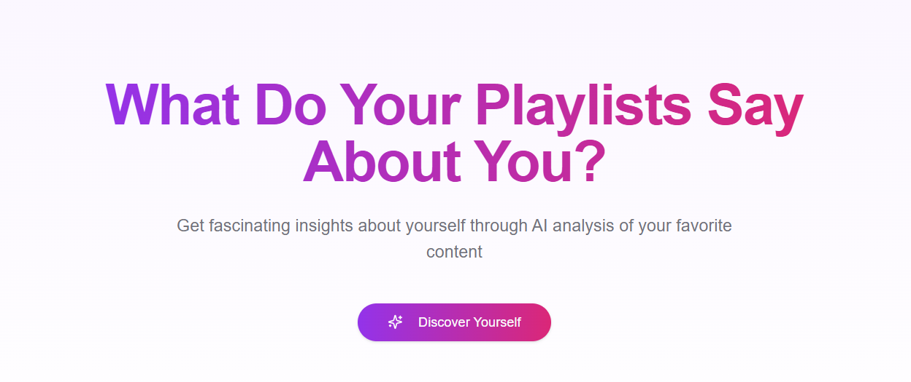
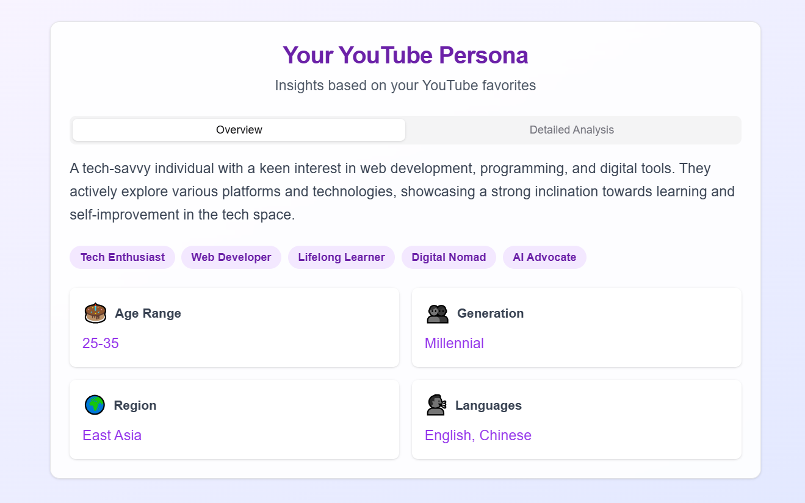

# YouTube 收藏夹分析器后端

<p align="right">
    <a href="README-zh.md">🇨🇳 中文</a> | <a href="README.md">🇬🇧 English</a>
</p>




## 注意：

`这是一个没有数据库的分析器后端，您可以轻松克隆并在自己的服务器上运行。

如果您想添加数据库，请自行添加。
`

## 📊 YouTube 收藏夹分析器

**YouTube 收藏夹分析器**是一个强大的工具，通过分析YouTube用户的收藏播放列表来推断他们的人口统计特征、兴趣和特点。通过利用YouTube API和OpenAI的GPT功能，该项目可以根据用户的收藏内容提供深入的用户画像。

<p align="center">
    
</p>

## 🚀 功能特点

- **YouTube数据集成**：获取并处理您的YouTube收藏播放列表
- **用户画像生成**：生成包括人口统计和兴趣的详细用户画像
- **格式化与常规响应**：可选择结构化的格式化响应或普通输出
- **简单设置**：简单的安装和配置过程
- **可扩展**：易于扩展额外功能和集成

## 🔧 安装

1. **克隆仓库**

   ```bash
   git clone https://github.com/xbhk/get_YouTubeProfile_through_LLM.git
   cd get_YouTubeProfile_through_LLM
   ```

2. **创建虚拟环境**

   建议使用虚拟环境管理依赖。

   ```bash
   python3 -m venv venv
   source venv/bin/activate
   ```

3. **安装依赖**

   所有必需的依赖都列在 `requirements.txt` 中。

   ```bash
   pip install -r requirements.txt
   ```

## 🛠️ 设置

### 1. Google 开发者 API

要使用 YouTube Data API，您需要设置凭据：

1. **创建项目**

   转到 [Google Cloud 控制台](https://console.cloud.google.com/) 并创建一个新项目。

2. **启用 YouTube Data API**

   导航到 **APIs & Services > 库**，搜索"YouTube Data API v3"，并启用它。

3. **创建凭据**

   - 转到 **APIs & Services > 凭据**。
   - 点击 **创建凭据 > OAuth 客户端 ID**。
   - 选择 **桌面应用** 并提供名称。
   - 下载 `credentials.json` 文件并将其放置在项目根目录。

   ```bash
   mv 下载路径/credentials.json secrets-local.json
   ```

### 2. OpenAI API 密钥

该项目使用 OpenAI 的 GPT 生成详细的用户画像。设置步骤如下：

1. **获取 API 密钥**

   在 [OpenAI](https://platform.openai.com/) 注册并转到 API 部分以获取您的 API 密钥。

2. **设置环境变量**

   在项目根目录创建 `.env` 文件，并添加您的 OpenAI API 密钥：

   ```env
   OPENAI_API_KEY=您的openai_api_key
   ```

### 3. 环境变量

确保在项目根目录中有 `.env` 文件，并包含必要的环境变量：

```env
OPENAI_API_KEY=您的openai_api_key
```

## 📁 项目结构

```
get_YouTubeProfile_through_LLM/
├── youtube-onelayers.py
├── functionOneLayer
├── profile.md
├── requirements.txt
├── secrets-local.json
├── .env
└── README.md
```

## 💡 使用方法

运行主脚本以根据您的 YouTube 收藏播放列表生成用户画像：

```bash
python youtube-onelayers.py
```

脚本将执行以下操作：

1. 使用 YouTube API 进行身份验证。
2. 获取您的收藏播放列表。
3. 分析播放列表以生成用户画像。
4. 将画像输出到 `profile.md`。

### 输出

- **常规响应**：保存在 `profile.md` 的纯文本用户画像。
- **格式化响应**：保存在 `profile.md` 的结构化和详细用户画像。

## 📄 常规响应示例 `profile.md`

> **注意：** 你可以在 regularModel.py (formatModel.py)中修改prompt，来让模型使用中文输出。


🤯 Playlist Analysis Complete!

📊 Core Demographics:
- **Age Range**: Likely 18-35 years
- **Gender**: Predominantly male
- **Likely Region**: Asia (with specific interests in China)

🎯 Key Insights:
- **Primary Interests**: 
  1. Web Development (including AI tools and frameworks)
  2. Personal Productivity (like journaling and learning tools)
  3. Current Affairs & Social Issues
- **Content Level**: Enthusiast 

......


## 📄 格式化响应示例

> **注意：** 我已经与前端集成。



## 🤝 贡献

欢迎贡献！请开启 issue 或提交 pull request 以进行任何增强或 bug 修复。

## 📞 联系

如有任何问题或建议，请随时联系 [shanshuilang0@gmail.com](mailto:shanshuilang0@gmail.com)。