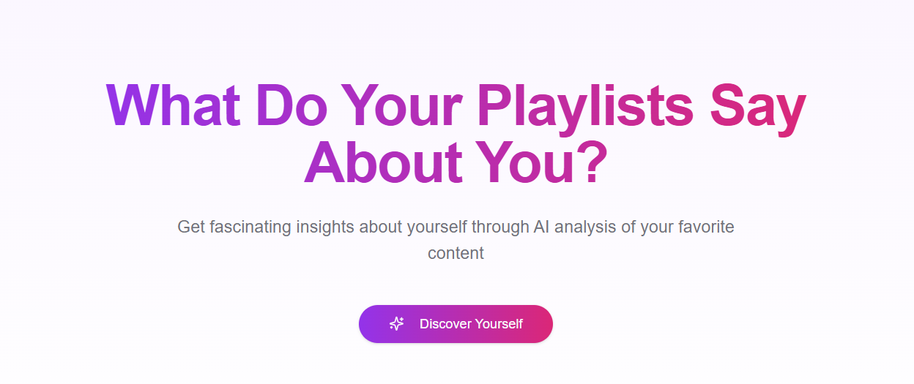
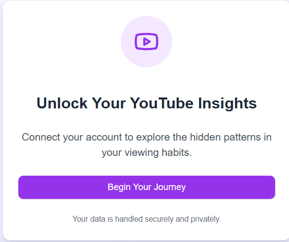
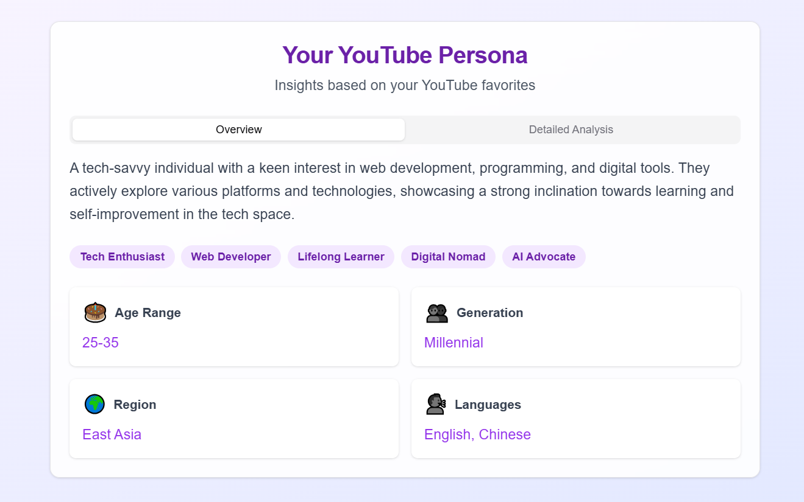

# YouTube Favorite Analyzer Backend



## Note:

`This is the backend part of the analyzer without database, so you can easily clone it and run it on your own server.

If you want to add database, help yourself to add it.
`

## 📊 YouTube Favorite Analyzer

**YouTube Favorite Analyzer** is a powerful tool that analyzes a YouTube user's favorite playlists to infer their demographics, interests, and characteristics. By leveraging the YouTube API and OpenAI's GPT capabilities, this project provides insightful profiles based on the user's favorite content.

<div align="center">
    
</div>

## 🚀 Features

- **YouTube Data Integration**: Fetches and processes your favorite YouTube playlists.
- **Profile Generation**: Generates detailed user profiles including demographics and interests.
- **Formatted & Regular Responses**: Choose between structured formatted responses or plain regular outputs.
- **Easy Setup**: Simple installation and configuration process.
- **Extensible**: Easily extendable with additional features and integrations.

## 🔧 Installation

1. **Clone the Repository**

   ```bash
   git clone https://github.com/xbhk/get_YouTubeProfile_through_LLM.git
   cd get_YouTubeProfile_through_LLM
   ```

2. **Create a Virtual Environment**

   It's recommended to use a virtual environment to manage dependencies.

   ```bash
   python3 -m venv venv
   source venv/bin/activate
   ```

3. **Install Dependencies**

   All required dependencies are listed in `requirements.txt`.

   ```bash
   pip install -r requirements.txt
   ```

## 🛠️ Setup

### 1. Google Developer API

To use the YouTube Data API, you need to set up credentials:

1. **Create a Project**

   Go to the [Google Cloud Console](https://console.cloud.google.com/) and create a new project.

2. **Enable YouTube Data API**

   Navigate to **APIs & Services > Library**, search for "YouTube Data API v3", and enable it.

3. **Create Credentials**

   - Go to **APIs & Services > Credentials**.
   - Click **Create Credentials > OAuth client ID**.
   - Choose **Desktop app** and provide a name.
   - Download the `credentials.json` file and place it in the project root directory.

   ```bash
   mv path/to/downloaded/credentials.json secrets-local.json
   ```

### 2. OpenAI API Key

This project uses OpenAI's GPT for generating detailed profiles. To set it up:

1. **Obtain API Key**

   Sign up at [OpenAI](https://platform.openai.com/) and navigate to the API section to obtain your API key.

2. **Set Up Environment Variable**

   Create a `.env` file in the project root directory and add your OpenAI API key:

   ```env
   OPENAI_API_KEY=your_openai_api_key_here
   ```

### 3. Environment Variables

Ensure you have a `.env` file in the project root with the necessary environment variables:

```env
OPENAI_API_KEY=your_openai_api_key_here
```

## 📁 Project Structure

```
get_YouTubeProfile_through_LLM/
├── youtube-onelayers.py
├── functionOneLayer
├── profile.md
├── requirements.txt
├── secrets-local.json
├── .env
└── README.md
```

## 💡 Usage

Run the main script to generate your profile based on your YouTube favorite playlists:

```bash
python youtube-onelayers.py
```

The script will perform the following:

1. Authenticate with the YouTube API.
2. Fetch your favorite playlists.
3. Analyze the playlists to generate a user profile.
4. Output the profile to `profile.md`.

### Output

- **Regular Response**: A plain text profile saved in `profile.md`.
- **Formatted Response**: A structured and detailed profile saved in `profile.md`.

> **Note:** Replace `path/to/...` with the actual paths to your images.

## 📄 Example `profile.txt`

🤯 Playlist Analysis Complete!

📊 Core Demographics:
- **Age Range**: Likely 18-35 years
- **Gender**: Predominantly male
- **Likely Region**: Asia (with specific interests in China)

🎯 Key Insights:
- **Primary Interests**: 
  1. Web Development (including AI tools and frameworks)
  2. Personal Productivity (like journaling and learning tools)
  3. Current Affairs & Social Issues
- **Content Level**: Enthusiast 
- **Notable Patterns**: Strong interest in practical tutorials and discussions about social issues and economic contexts; tends to engage with both educational and entertaining content.

🧝 Your Characteristics:
1. **Curious** - You enjoy learning new technologies and frameworks, as shown by your interest in web development and AI tools.
2. **Open-Minded** - You explore a variety of topics, including social issues and cultural discussions.
3. **Pragmatic** - You lean towards practical applications and tutorials that can assist you in your personal or professional projects.
4. **Socially Aware** - You follow content that touches on economic and political themes, demonstrating a sense of responsibility and awareness towards societal issues.

🌟 Content Preferences:
1. **Tutorials and How-To Videos** - You prefer structured content that guides you through learning processes, especially related to tech and productivity tools.
2. **Current Events and Cultural Commentary** - Showing interest in videos discussing societal topics shows your engagement with the world around you.
3. **Innovative Tools and Techniques** - You're drawn to the latest trends and tools that can enhance your productivity or web development skills, pointing to a mindset that values innovation.

✨ Fun Fact: Your eclectic mix of interests suggests that you might be the go-to person among your friends for tech advice or recommendations on the latest productivity apps! 🧐 We will be glad if we guess right! 🧐

## Example of Formatted Response

> **Note:** I have already intergrated with the frontend.



## 🤝 Contributing

Contributions are welcome! Please open an issue or submit a pull request for any enhancements or bug fixes.

## 📞 Contact

For any questions or suggestions, feel free to reach out at [shanshuilang0@gmail.com](mailto:shanshuilang0@gmail.com).


